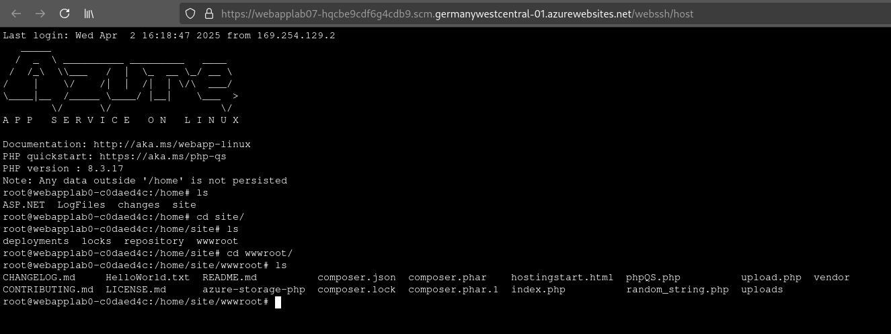
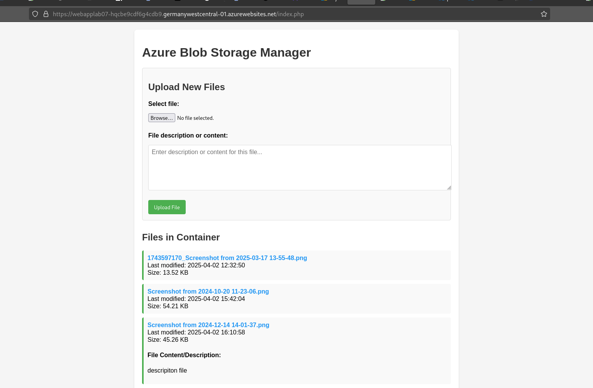
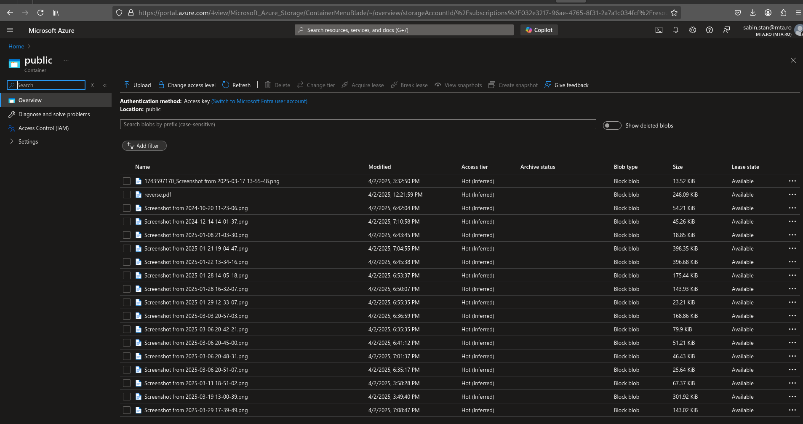
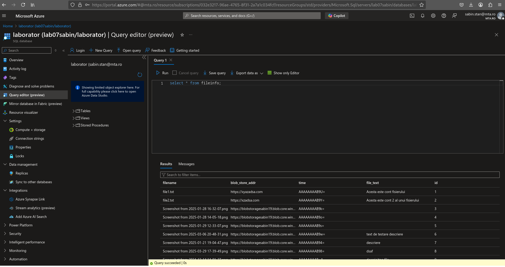
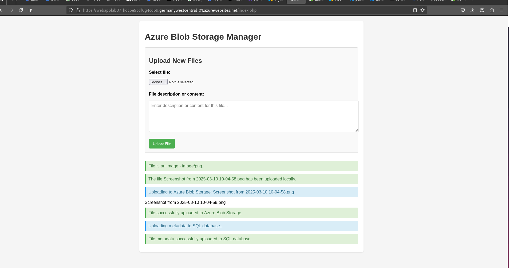

# Dezvoltarea unui Manager de Fisiere pentru Azure Blob Storage

## Obiectiv

Dezvoltarea unei aplicatii web PHP care permite utilizatorilor sa incarce fisiere in Azure Blob Storage si sa pastreze metadatele asociate intr-o baza de date SQL Azure.

## Tehnologii utilizate

- PHP 8.3.17 (Azure App Service)
- Azure Blob Storage
- Azure SQL Database
- HTML/CSS
- JavaScript

## Procesul de dezvoltare

### 1. Configurarea mediului de lucru

Am inceput prin crearea unei aplicatii web PHP pe Azure App Service, accesibila prin SSH pentru dezvoltare directa pe server, asa cum se poate vedea in imagea 5:



Structura de baza a proiectului include:

- index.php - interfata principala
- vendor/ - biblioteci externe (incluzand Azure SDK)
- uploads/ - director temporar pentru fisiere inainte de upload

### 2. Implementarea formularului de upload

Prima etapa a constat in crearea unui formular HTML pentru selectarea fisierelor si introducerea unei descrieri:



Formularul include:

- Selector de fisiere
- Camp text pentru descriere/continut
- Buton de incarcare

### 3. Integrarea cu Azure Blob Storage

Am implementat codul PHP pentru upload-ul fisierelor in Azure Blob Storage utilizand Azure SDK pentru PHP:

```php
$connectionString = "DefaultEndpointsProtocol=https;AccountName=blobstoragesabin19;AccountKey=...";
$blobClient = BlobRestProxy::createBlobService($connectionString);
$containerName = "public";
$content = fopen($target_file, "r");
$blobClient->createBlockBlob($containerName, $fileToUpload, $content);
```

Containerul "public" din Azure Blob Storage stocheaza fisierele incarcate:



### 4. Integrarea cu Azure SQL Database

Pentru a pastra metadatele fisierelor, am creat o baza de date SQL in Azure cu tabela `fileinfo` continand urmatoarele campuri:

- id (auto-increment)
- filename
- blob_store_addr (URL-ul fisierului)
- time (timestamp)
- file_text (descrierea sau continutul)

Am implementat codul pentru inserarea datelor in baza de date:

```php
$conn = new PDO("sqlsrv:server = tcp:lab07sabin.database.windows.net,1433; Database = laborator", "sabinghost19", "***");
$sql = "INSERT INTO fileinfo (filename, blob_store_addr, file_text) VALUES (?, ?, ?)";
$stmt = $conn->prepare($sql);
$stmt->execute([$fileToUpload, $blob_store_addr, $file_text]);
```

Tabela populata cu datele fisierelor incarcate:



### 5. Afisarea fisierelor incarcate

Am implementat o functionalitate pentru afisarea tuturor fisierelor disponibile in containerul de Azure, impreuna cu metadatele lor:



Dupa incarcare, aplicatia afiseaza:

- Statusul procesului de upload (local, Azure, SQL)
- Lista completa a fisierelor existente in container

### 6. Optimizari de functionare

Am adaugat mai multe functionalitati si optimizari:

- Stergerea fisierelor locale dupa incarcare in Azure si in baza de date
- Validarea fisierelor (verificare tip, dimensiune)
- Afisarea mesajelor de status (succes, eroare)
- Stilizare CSS pentru o interfata utilizator mai placuta

### 7. Probleme intampinate si rezolvari

#### Problema 1: Pierderea listei de fisiere dupa upload

Am observat ca dupa procesarea unui fisier, lista fisierelor nu mai era afisata. Am rezolvat acest lucru prin:

- Crearea unei functii dedicate pentru afisarea listei
- Apelarea acestei functii la sfarsitul script-ului, indiferent de rezultatul upload-ului

#### Problema 2: Erori la stergerea fisierelor locale

Fisierele locale nu puteau fi sterse dupa upload. Am rezolvat prin:

- Inchiderea explicita a handle-urilor de fisiere inainte de stergere
- Adaugarea verificarilor de permisiuni

#### Problema 3: Erori la inserarea in baza de date

Coloana `time` din baza de date era de tip `timestamp`, care nu accepta valori explicite. Am rezolvat prin:

- Modificarea query-ului pentru a exclude aceasta coloana
- Permiterea generarii automate a valorii timestamp

## Rezultat final

Aplicatia finala ofera o interfata web simpla dar functionala pentru:

1. Incarcarea fisierelor in Azure Blob Storage
2. Stocarea metadatelor in Azure SQL Database
3. Vizualizarea fisierelor existente cu detalii complete

Procesul complet de incarcare include:

1. Upload local temporar
2. Transfer in Azure Blob Storage
3. Salvare metadata in Azure SQL
4. Stergere fisier local
5. Afisare lista actualizata de fisiere
